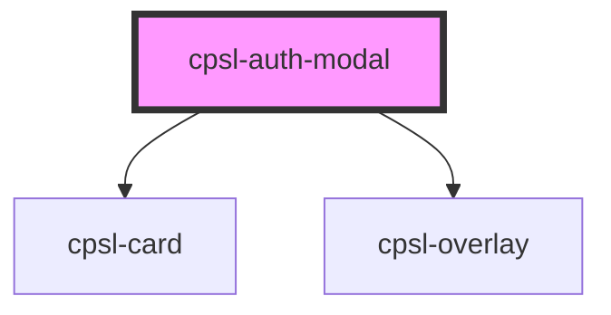

# cpsl-auth-modal

<!-- Auto Generated Below -->

## Properties

| Property                  | Attribute                   | Description                                                                                             | Type      | Default     |
| ------------------------- | --------------------------- | ------------------------------------------------------------------------------------------------------- | --------- | ----------- |
| `enterTransitionDuration` | `enter-transition-duration` | Duration in seconds of the modal entering. Default is .15.                                              | `number`  | `0.15`      |
| `exitTransitionDuration`  | `exit-transition-duration`  | Duration in seconds of the modal exiting. Default is .15.                                               | `number`  | `0.15`      |
| `noOverlay`               | `no-overlay`                | Whether or not to show the overlay. This will always show the modal, regardless of the value of `open`. | `boolean` | `undefined` |
| `open`                    | `open`                      | Whether or not to show the modal.                                                                       | `boolean` | `undefined` |
| `zIndexOverride`          | `z-index-override`          | Override z-index.                                                                                       | `number`  | `undefined` |

## Events

| Event                   | Description                            | Type                |
| ----------------------- | -------------------------------------- | ------------------- |
| `cpslModalEntered`      | Emitted when enter animation finishes. | `CustomEvent<null>` |
| `cpslModalEntering`     | Emitted when enter animation starts.   | `CustomEvent<null>` |
| `cpslModalExited`       | Emitted when exit animation finishes.  | `CustomEvent<null>` |
| `cpslModalExiting`      | Emitted when exit animation starts.    | `CustomEvent<null>` |
| `cpslModalRequestClose` | Emitted when exit animation finishes.  | `CustomEvent<null>` |

## Shadow Parts

| Part                    | Description |
| ----------------------- | ----------- |
| `"modal-body-card"`     |             |
| `"modal-container"`     |             |
| `"modal-footer"`        |             |
| `"modal-mobile-footer"` |             |

## Dependencies

### Depends on

- [cpsl-card](../cpsl-card)
- [cpsl-overlay](../cpsl-overlay)

### Graph

----------------------------------------------

*Built with [StencilJS](https://stenciljs.com/)*
