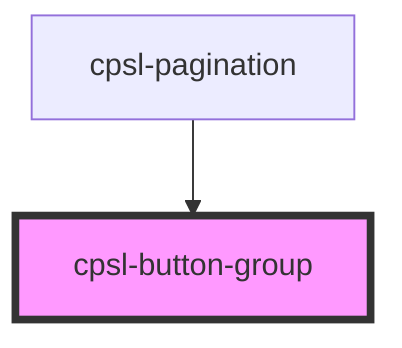

# cpsl-button-group

<!-- Auto Generated Below -->

## Properties

| Property     | Attribute     | Description                    | Type     | Default     |
| ------------ | ------------- | ------------------------------ | -------- | ----------- |
| `selectedId` | `selected-id` | The id of the selected button. | `string` | `undefined` |

## Dependencies

### Used by

 - [cpsl-pagination](../cpsl-pagination)

### Graph

----------------------------------------------

*Built with [StencilJS](https://stenciljs.com/)*
