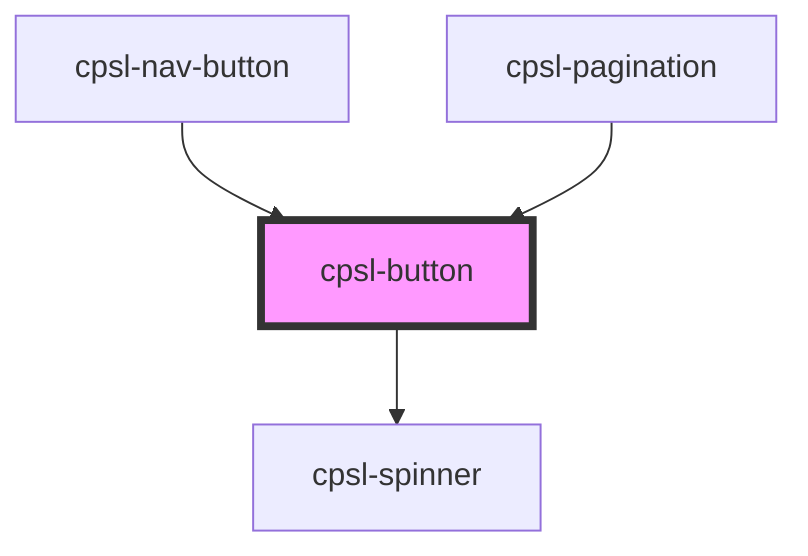

# cpsl-button

<!-- Auto Generated Below -->

## Properties

| Property    | Attribute    | Description                                                                                                                          | Type                                                                 | Default     |
| ----------- | ------------ | ------------------------------------------------------------------------------------------------------------------------------------ | -------------------------------------------------------------------- | ----------- |
| `as`        | `as`         | The tag for the button. Options are: `"button"`, `"a". Default is: `"button"`.                                                       | `"a" \| "button"`                                                    | `'button'`  |
| `disabled`  | `disabled`   | If the button is disabled. Default is: false.                                                                                        | `boolean`                                                            | `false`     |
| `fullWidth` | `full-width` | Whether the button takes the full width of it's container. Default is: false.                                                        | `boolean`                                                            | `false`     |
| `href`      | `href`       | href to use when using a link.                                                                                                       | `string`                                                             | `undefined` |
| `pending`   | `pending`    | If the button is pending. Default is: false.                                                                                         | `boolean`                                                            | `false`     |
| `size`      | `size`       | The size of the button. Options are: `"small"`, `"medium". Default is: `"medium"`.                                                   | `"medium" \| "small" \| "xSmall"`                                    | `'medium'`  |
| `target`    | `target`     | target to use when using a link.                                                                                                     | `string`                                                             | `undefined` |
| `type`      | `type`       | The type of the button.                                                                                                              | `"button" \| "reset" \| "submit"`                                    | `'button'`  |
| `variant`   | `variant`    | The variant of the button. Options are: `"primary"`, `"secondary", `"tertiary", `"ghost"`, `"destructive"`. Default is: `"primary"`. | `"destructive" \| "ghost" \| "primary" \| "secondary" \| "tertiary"` | `'primary'` |

## Shadow Parts

| Part              | Description |
| ----------------- | ----------- |
| `"button-native"` |             |

## Dependencies

### Used by

 - [cpsl-nav-button](../cpsl-nav-button)
 - [cpsl-pagination](../cpsl-pagination)

### Depends on

- [cpsl-spinner](../cpsl-spinner)

### Graph

----------------------------------------------

*Built with [StencilJS](https://stenciljs.com/)*
