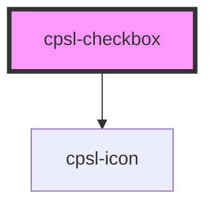

# cpsl-checkbox

<!-- Auto Generated Below -->

## Properties

| Property  | Attribute | Description                             | Type      | Default     |
| --------- | --------- | --------------------------------------- | --------- | ----------- |
| `checked` | `checked` | Whether or not the checkbox is checked. | `boolean` | `undefined` |

## Events

| Event                 | Description                              | Type                   |
| --------------------- | ---------------------------------------- | ---------------------- |
| `cpslCheckboxChanged` | Emitted when the checkbox state changes. | `CustomEvent<boolean>` |

## Dependencies

### Depends on

- [cpsl-icon](../cpsl-icon)

### Graph

----------------------------------------------

*Built with [StencilJS](https://stenciljs.com/)*
