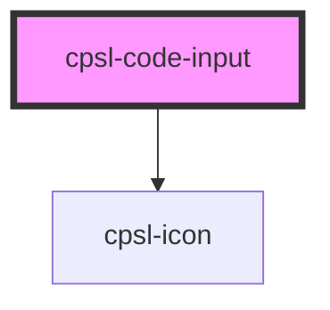

# cpsl-code-input

<!-- Auto Generated Below -->

## Properties

| Property     | Attribute     | Description                                                                                  | Type                   | Default     |
| ------------ | ------------- | -------------------------------------------------------------------------------------------- | ---------------------- | ----------- |
| `code`       | `code`        | Value of the code.                                                                           | `string`               | `undefined` |
| `errorText`  | `error-text`  | Error text to show below the input. If this is provided the input will enter an error state. | `string`               | `undefined` |
| `helperText` | `helper-text` | Helper text to show below the input. If `"errorText"` is provided that will take precedence. | `string`               | `undefined` |
| `length`     | `length`      | Length of the code.                                                                          | `number`               | `undefined` |
| `type`       | `type`        | Type of characters to accept in the code. Defaults to number.                                | `"number" \| "string"` | `'number'`  |

## Events

| Event       | Description                                                                   | Type                                 |
| ----------- | ----------------------------------------------------------------------------- | ------------------------------------ |
| `cpslInput` | The `cpslInput` event is fired each time the user modifies the input's value. | `CustomEvent<CodeChangeEventDetail>` |

## Dependencies

### Depends on

- [cpsl-icon](../cpsl-icon)

### Graph

----------------------------------------------

*Built with [StencilJS](https://stenciljs.com/)*
