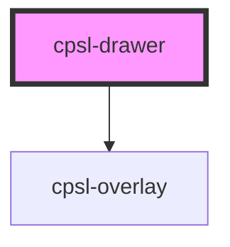

# cpsl-drawer

<!-- Auto Generated Below -->

## Properties

| Property             | Attribute             | Description                                                                                                                                                                             | Type                                     | Default         |
| -------------------- | --------------------- | --------------------------------------------------------------------------------------------------------------------------------------------------------------------------------------- | ---------------------------------------- | --------------- |
| `anchor`             | `anchor`              | Side from which the drawer will enter from.                                                                                                                                             | `"bottom" \| "left" \| "right" \| "top"` | `undefined`     |
| `anchorPosition`     | `anchor-position`     | Starting anchor position.                                                                                                                                                               | `number`                                 | `undefined`     |
| `noOverlay`          | `no-overlay`          | Hides the overlay for temporary drawers.                                                                                                                                                | `boolean`                                | `undefined`     |
| `open`               | `open`                | Whether the drawer is open or not.                                                                                                                                                      | `boolean`                                | `undefined`     |
| `size`               | `size`                | Size (height or width) of the drawer.                                                                                                                                                   | `"auto" \| number`                       | `undefined`     |
| `transitionDuration` | `transition-duration` | Duration in seconds of the open/close animation. Default is 0.15.                                                                                                                       | `number`                                 | `0.15`          |
| `transitionFunction` | `transition-function` | Transition timing function to use. Default is ease-in-out.                                                                                                                              | `string`                                 | `'ease-in-out'` |
| `variant`            | `variant`             | The variant of the drawer. `temporary` drawers will cover content and contain a backdrop. `permanent` drawers will sit beside content, i.e. desktop navigation. Default is `temporary`. | `"permanent" \| "temporary"`             | `'temporary'`   |
| `zIndexOverride`     | `z-index-override`    | Override z-index.                                                                                                                                                                       | `number`                                 | `undefined`     |

## Shadow Parts

| Part          | Description |
| ------------- | ----------- |
| `"container"` |             |

## Dependencies

### Depends on

- [cpsl-overlay](../cpsl-overlay)

### Graph

----------------------------------------------

*Built with [StencilJS](https://stenciljs.com/)*
