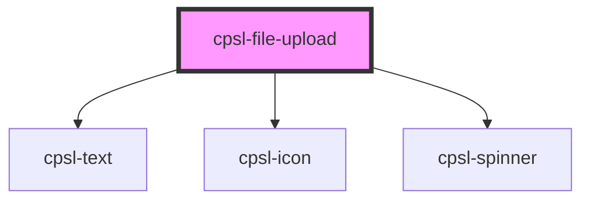

# cpsl-file-upload

<!-- Auto Generated Below -->

## Properties

| Property            | Attribute             | Description                                                                                  | Type                               | Default     |
| ------------------- | --------------------- | -------------------------------------------------------------------------------------------- | ---------------------------------- | ----------- |
| `errorText`         | `error-text`          | Error text to show below the input. If this is provided the input will enter an error state. | `string`                           | `undefined` |
| `externalFilename`  | `external-filename`   | Filename for the external source of the selected file.                                       | `string`                           | `undefined` |
| `externalSrc`       | `external-src`        | External source for the selected file.                                                       | `string`                           | `undefined` |
| `fileTypes`         | --                    | Valid file types.                                                                            | `string[]`                         | `undefined` |
| `helperText`        | `helper-text`         | Helper text to show below the input. If `"errorText"` is provided that will take precedence. | `string`                           | `undefined` |
| `label`             | `label`               | The label for the input.                                                                     | `string`                           | `undefined` |
| `required`          | `required`            | If `true`, the user must fill in a value before submitting a form.                           | `boolean`                          | `false`     |
| `showOptionalLabel` | `show-optional-label` | If `true`, the label will display an "optional" tag.                                         | `boolean`                          | `false`     |
| `uploadFile`        | --                    | Function to trigger file upload to server. Returns: boolean indicating success or failure.   | `(file: File) => Promise<boolean>` | `undefined` |

## Events

| Event             | Description                                    | Type                     |
| ----------------- | ---------------------------------------------- | ------------------------ |
| `cpslFileChange`  | Emitted when the file changes.                 | `CustomEvent<File>`      |
| `cpslFileRemoved` | Emitted when the file is removed.              | `CustomEvent<void>`      |
| `cpslOnDragEnter` | Emitted when the file drag enters the input.   | `CustomEvent<DragEvent>` |
| `cpslOnDragLeave` | Emitted when the file drag leaves the input.   | `CustomEvent<DragEvent>` |
| `cpslOnDrop`      | Emitted when the file is dropped in the input. | `CustomEvent<DragEvent>` |

## Dependencies

### Depends on

- [cpsl-text](../cpsl-text)
- [cpsl-icon](../cpsl-icon)
- [cpsl-spinner](../cpsl-spinner)

### Graph

----------------------------------------------

*Built with [StencilJS](https://stenciljs.com/)*
