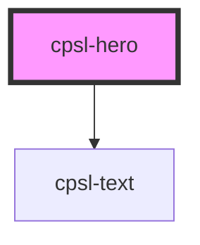

# cpsl-hero

<!-- Auto Generated Below -->

## Properties

| Property   | Attribute  | Description                                                                                           | Type                                                  | Default        |
| ---------- | ---------- | ----------------------------------------------------------------------------------------------------- | ----------------------------------------------------- | -------------- |
| `subtitle` | `subtitle` |                                                                                                       | `string`                                              | `undefined`    |
| `title`    | `title`    |                                                                                                       | `string`                                              | `undefined`    |
| `variant`  | `variant`  | The variant of the button. Options are: `"default"`, `"loading", `"success". Default is: `"default"`. | `"approved" \| "connection" \| "failed" \| "pending"` | `'connection'` |

## Dependencies

### Depends on

- [cpsl-text](../cpsl-text)

### Graph

----------------------------------------------

*Built with [StencilJS](https://stenciljs.com/)*
