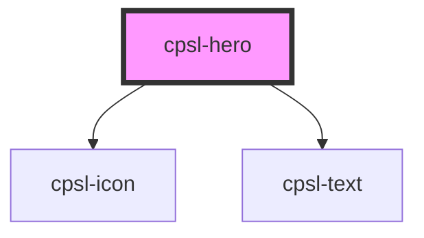

# cpsl-hero

<!-- Auto Generated Below -->

## Properties

| Property           | Attribute            | Description                                                                                                                                                                     | Type                                                                                                            | Default        |
| ------------------ | -------------------- | ------------------------------------------------------------------------------------------------------------------------------------------------------------------------------- | --------------------------------------------------------------------------------------------------------------- | -------------- |
| `height`           | `height`             | The height of the container. Default is: 180.                                                                                                                                   | `number`                                                                                                        | `undefined`    |
| `hideFadeOut`      | `hide-fade-out`      | Hides the fade out components Default is: `false`.                                                                                                                              | `boolean`                                                                                                       | `undefined`    |
| `subtitle`         | `subtitle`           |                                                                                                                                                                                 | `string`                                                                                                        | `undefined`    |
| `title`            | `title`              |                                                                                                                                                                                 | `string`                                                                                                        | `undefined`    |
| `variant`          | `variant`            | The variant of the button. Options are: `"customContent"`, `"connection"`, `"externalWalletConnection"`, `"pending", `"approved",`"add", `"failed". Default is: `"connection"`. | `"add" \| "approved" \| "connection" \| "customContent" \| "externalWalletConnection" \| "failed" \| "pending"` | `'connection'` |
| `withDefaultTheme` | `with-default-theme` | Whether to use the Capsule custom theming or use the provided theme Default is: `false`.                                                                                        | `boolean`                                                                                                       | `undefined`    |

## Dependencies

### Depends on

- [cpsl-icon](../cpsl-icon)
- [cpsl-text](../cpsl-text)

### Graph

----------------------------------------------

*Built with [StencilJS](https://stenciljs.com/)*
