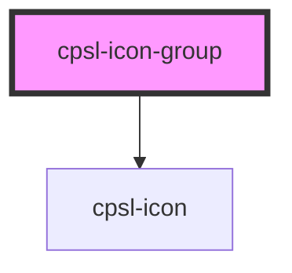

# cpsl-icon-group

<!-- Auto Generated Below -->

## Properties

| Property     | Attribute     | Description                                         | Type                | Default     |
| ------------ | ------------- | --------------------------------------------------- | ------------------- | ----------- |
| `disabled`   | `disabled`    | If `true`, the user cannot interact with the input. | `boolean`           | `false`     |
| `expandFrom` | `expand-from` | The direction the icons should expand from          | `"left" \| "right"` | `'right'`   |
| `icons`      | --            | The name of the icons to display.                   | `string[]`          | `undefined` |

## Shadow Parts

| Part               | Description |
| ------------------ | ----------- |
| `"icon-container"` |             |

## Dependencies

### Depends on

- [cpsl-icon](../cpsl-icon)

### Graph

----------------------------------------------

*Built with [StencilJS](https://stenciljs.com/)*
