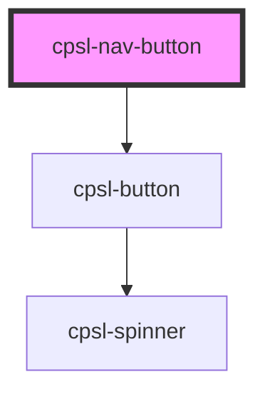

# cpsl-nav-button

<!-- Auto Generated Below -->

## Properties

| Property              | Attribute                | Description                                                       | Type                                  | Default     |
| --------------------- | ------------------------ | ----------------------------------------------------------------- | ------------------------------------- | ----------- |
| `disabled`            | `disabled`               | If the button is disabled. Default is: false.                     | `boolean`                             | `false`     |
| `exactMainRouteMatch` | `exact-main-route-match` | Whether or not to use exact matching for the selected main route. | `boolean`                             | `undefined` |
| `exactSubRouteMatch`  | `exact-sub-route-match`  | Whether or not to use exact matching for the selected sub route.  | `boolean`                             | `undefined` |
| `path`                | `path`                   | Path used to determine what button is selected                    | `string`                              | `undefined` |
| `route`               | `route`                  | The route for the button.                                         | `string`                              | `undefined` |
| `subRoutes`           | --                       | The id of the selected button.                                    | `{ label: string; value: string; }[]` | `undefined` |

## Events

| Event                        | Description                                    | Type                  |
| ---------------------------- | ---------------------------------------------- | --------------------- |
| `cpslNavButtonClick`         | Called when the nav button is clicked.         | `CustomEvent<string>` |
| `cpslNavButtonSubRouteClick` | Called when a nav button sub route is clicked. | `CustomEvent<string>` |

## Dependencies

### Depends on

- [cpsl-button](../cpsl-button)

### Graph

----------------------------------------------

*Built with [StencilJS](https://stenciljs.com/)*
