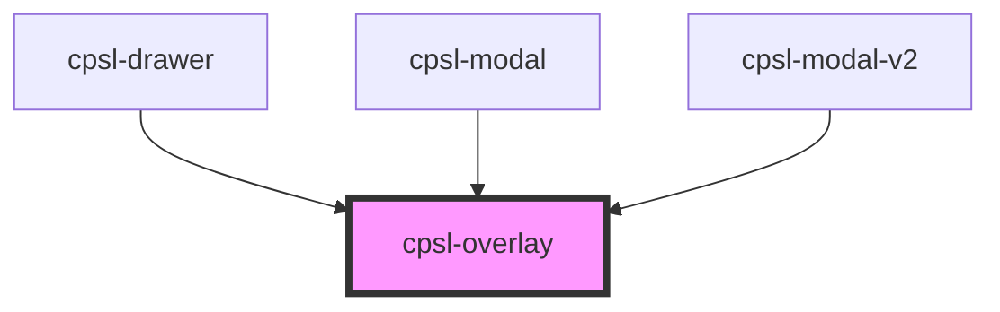

# cpsl-overlay

<!-- Auto Generated Below -->

## Properties

| Property                  | Attribute                   | Description                                                   | Type      | Default     |
| ------------------------- | --------------------------- | ------------------------------------------------------------- | --------- | ----------- |
| `enterTransitionDuration` | `enter-transition-duration` | Duration in seconds of the fade out animation. Default is .5. | `number`  | `0.5`       |
| `exitTransitionDuration`  | `exit-transition-duration`  | Duration in seconds of the fade out animation. Default is .5. | `number`  | `0.5`       |
| `open`                    | `open`                      | Whether or not to show the overlay.                           | `boolean` | `undefined` |
| `zIndexOverride`          | `z-index-override`          | Override z-index.                                             | `number`  | `undefined` |

## Dependencies

### Used by

 - [cpsl-drawer](../cpsl-drawer)
 - [cpsl-modal](../cpsl-modal)
 - [cpsl-modal-v2](../cpsl-modal-v2)

### Graph

----------------------------------------------

*Built with [StencilJS](https://stenciljs.com/)*
