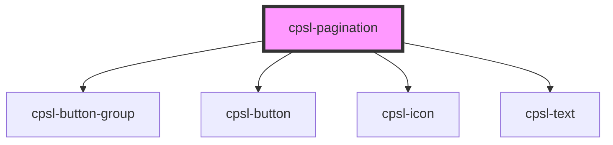

# cpsl-pagination

<!-- Auto Generated Below -->

## Properties

| Property       | Attribute       | Description                                                    | Type     | Default     |
| -------------- | --------------- | -------------------------------------------------------------- | -------- | ----------- |
| `initialPage`  | `initial-page`  | The initial page to select. Default is 0.                      | `number` | `undefined` |
| `totalPages`   | `total-pages`   | The total number of pages.                                     | `number` | `undefined` |
| `visiblePages` | `visible-pages` | The number of pages visible to select. Default is 5. Min is 5. | `number` | `5`         |

## Events

| Event                   | Description                           | Type                  |
| ----------------------- | ------------------------------------- | --------------------- |
| `cpslPaginationChanged` | Emitted when exit animation finishes. | `CustomEvent<number>` |

## Dependencies

### Depends on

- [cpsl-button-group](../cpsl-button-group)
- [cpsl-button](../cpsl-button)
- [cpsl-icon](../cpsl-icon)
- [cpsl-text](../cpsl-text)

### Graph

----------------------------------------------

*Built with [StencilJS](https://stenciljs.com/)*
