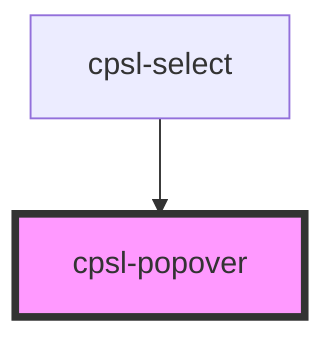

# cpsl-popover

<!-- Auto Generated Below -->

## Properties

| Property                    | Attribute                     | Description                                                                                                                   | Type                            | Default     |
| --------------------------- | ----------------------------- | ----------------------------------------------------------------------------------------------------------------------------- | ------------------------------- | ----------- |
| `alignCenter`               | `align-center`                | If `true`, the popover will be aligned to the center of the trigger element. Default is `false`.                              | `boolean`                       | `false`     |
| `anchorEl`                  | --                            | ID for the element that the popover anchors to.                                                                               | `HTMLElement`                   | `undefined` |
| `anchorOriginHorizontal`    | `anchor-origin-horizontal`    | Vertical anchor origin. Options are: `"left"`, `"center"`, `"right"`. Default is: `"left"`.                                   | `"center" \| "left" \| "right"` | `'left'`    |
| `anchorOriginVertical`      | `anchor-origin-vertical`      | Vertical anchor origin. Options are: `"top"`, `"center"`, `"bottom"`. Default is: `"bottom"`.                                 | `"bottom" \| "center" \| "top"` | `'bottom'`  |
| `autoWidth`                 | `auto-width`                  | If `true` the container will use the width of the content, else it will be set to the width of the trigger. Default is `true` | `boolean`                       | `true`      |
| `disabled`                  | `disabled`                    | Whether or not to disable to popover.                                                                                         | `boolean`                       | `undefined` |
| `preventBlur`               | `prevent-blur`                | Used internally to prevent select from blurring unintentionally.                                                              | `boolean`                       | `undefined` |
| `transformOriginHorizontal` | `transform-origin-horizontal` | Vertical transformation origin. Options are: `"left"`, `"center"`, `"right"`. Default is: `"left"`.                           | `"center" \| "left" \| "right"` | `'left'`    |
| `transformOriginVertical`   | `transform-origin-vertical`   | Vertical transformation origin. Options are: `"top"`, `"center"`, `"bottom"`. Default is: `"bottom"`.                         | `"bottom" \| "center" \| "top"` | `'top'`     |
| `trigger`                   | `trigger`                     | ID for the element that triggers the popover to open.                                                                         | `string`                        | `undefined` |
| `triggerAction`             | `trigger-action`              | Which trigger causes the popover to open. Options are: `"click"`, `"hover"`. Default is: `"click"`.                           | `"click" \| "hover"`            | `'click'`   |
| `windowPadding`             | `window-padding`              | Padding from edge of window for the popover container.                                                                        | `number`                        | `16`        |

## Events

| Event       | Description                      | Type                |
| ----------- | -------------------------------- | ------------------- |
| `cpslClose` | Emitted when the popover closes. | `CustomEvent<void>` |
| `cpslOpen`  | Emitted when the popover opens.  | `CustomEvent<void>` |

## Methods

### `closePopover() => Promise<void>`

Call to close the popover manually.

#### Returns

Type: `Promise<void>`

## Dependencies

### Used by

 - [cpsl-select](../cpsl-select)

### Graph

----------------------------------------------

*Built with [StencilJS](https://stenciljs.com/)*
