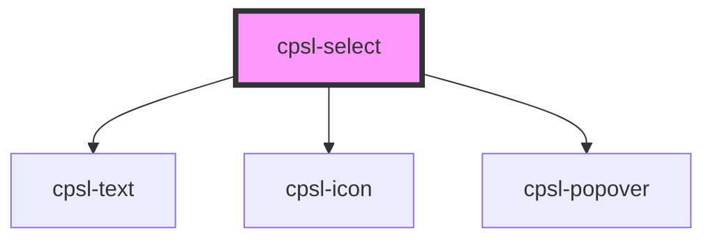

# cpsl-select

<!-- Auto Generated Below -->

## Properties

| Property                    | Attribute                      | Description                                                                                                          | Type                        | Default                     |
| --------------------------- | ------------------------------ | -------------------------------------------------------------------------------------------------------------------- | --------------------------- | --------------------------- |
| `disabled`                  | `disabled`                     | If `true`, the user cannot interact with the input.                                                                  | `boolean`                   | `false`                     |
| `dropdownMaxHeight`         | `dropdown-max-height`          | Set the max height of the dropdown.                                                                                  | `number`                    | `undefined`                 |
| `errorText`                 | `error-text`                   | Error text to show below the input. If this is provided the input will enter an error state.                         | `string`                    | `undefined`                 |
| `formatValue`               | --                             | Format value for display when selected.                                                                              | `(value: string) => string` | `undefined`                 |
| `helperText`                | `helper-text`                  | Helper text to show below the input. If `"errorText"` is provided that will take precedence.                         | `string`                    | `undefined`                 |
| `id`                        | `id`                           | ID of the element, must be unique for the popover trigger.                                                           | `string`                    | ``${this.inputId}-trigger`` |
| `label`                     | `label`                        | The label for the input.                                                                                             | `string`                    | `undefined`                 |
| `placeholder`               | `placeholder`                  | Placeholder to display if `selectedValue` is empty.                                                                  | `string`                    | `undefined`                 |
| `required`                  | `required`                     | If `true`, the user must fill in a value before submitting a form.                                                   | `boolean`                   | `false`                     |
| `selectedValue`             | `selected-value`               | Value of the selected item.                                                                                          | `string`                    | `undefined`                 |
| `showFormattedSelectedItem` | `show-formatted-selected-item` | Will show the formatted selected item (passed in the `selected-item` slot) in the select rather than the item value. | `boolean`                   | `undefined`                 |
| `showOptionalLabel`         | `show-optional-label`          | If `true`, the label will display an "optional" tag.                                                                 | `boolean`                   | `false`                     |

## Events

| Event                   | Description                         | Type                      |
| ----------------------- | ----------------------------------- | ------------------------- |
| `cpslBlur`              | Emitted when the input loses focus. | `CustomEvent<FocusEvent>` |
| `cpslFocus`             | Emitted when the input has focus.   | `CustomEvent<FocusEvent>` |
| `cpslSelectValueChange` | Emitted when the value changes.     | `CustomEvent<string>`     |

## Dependencies

### Depends on

- [cpsl-text](../cpsl-text)
- [cpsl-icon](../cpsl-icon)
- [cpsl-popover](../cpsl-popover)

### Graph

----------------------------------------------

*Built with [StencilJS](https://stenciljs.com/)*
