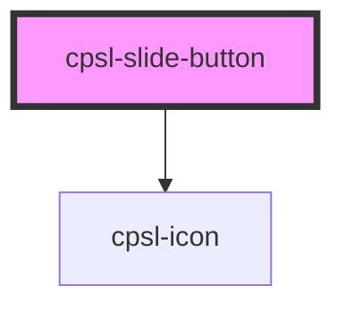

# cpsl-slide-button

<!-- Auto Generated Below -->

## Properties

| Property    | Attribute    | Description                                                                                    | Type                                                                                                                                                                                                                                                                                                                                                                                                                                                                                                                                                                                                                                                                                                                                                                                                                                                                                                                                                                                                                                                                                                                                                                                                                                                                                                                                                                                                                                                                                                                                                                                                                                                                                                                                                                                                                                                                                                                                                                                                                                                                                                                                                                                                                                                                                                                                                                                                                                                                                                                                                                                                                                                                                                                                                                                                                                                                                                                                                                                                                                                                                                                                                                                                                                                                                                                                                                                                                                                                                                                                                                                                                                             | Default     |
| ----------- | ------------ | ---------------------------------------------------------------------------------------------- | ------------------------------------------------------------------------------------------------------------------------------------------------------------------------------------------------------------------------------------------------------------------------------------------------------------------------------------------------------------------------------------------------------------------------------------------------------------------------------------------------------------------------------------------------------------------------------------------------------------------------------------------------------------------------------------------------------------------------------------------------------------------------------------------------------------------------------------------------------------------------------------------------------------------------------------------------------------------------------------------------------------------------------------------------------------------------------------------------------------------------------------------------------------------------------------------------------------------------------------------------------------------------------------------------------------------------------------------------------------------------------------------------------------------------------------------------------------------------------------------------------------------------------------------------------------------------------------------------------------------------------------------------------------------------------------------------------------------------------------------------------------------------------------------------------------------------------------------------------------------------------------------------------------------------------------------------------------------------------------------------------------------------------------------------------------------------------------------------------------------------------------------------------------------------------------------------------------------------------------------------------------------------------------------------------------------------------------------------------------------------------------------------------------------------------------------------------------------------------------------------------------------------------------------------------------------------------------------------------------------------------------------------------------------------------------------------------------------------------------------------------------------------------------------------------------------------------------------------------------------------------------------------------------------------------------------------------------------------------------------------------------------------------------------------------------------------------------------------------------------------------------------------------------------------------------------------------------------------------------------------------------------------------------------------------------------------------------------------------------------------------------------------------------------------------------------------------------------------------------------------------------------------------------------------------------------------------------------------------------------------------------------------ | ----------- |
| `disabled`  | `disabled`   | Whether or not the component is disabled. If true, the component will display the `startText`. | `boolean`                                                                                                                                                                                                                                                                                                                                                                                                                                                                                                                                                                                                                                                                                                                                                                                                                                                                                                                                                                                                                                                                                                                                                                                                                                                                                                                                                                                                                                                                                                                                                                                                                                                                                                                                                                                                                                                                                                                                                                                                                                                                                                                                                                                                                                                                                                                                                                                                                                                                                                                                                                                                                                                                                                                                                                                                                                                                                                                                                                                                                                                                                                                                                                                                                                                                                                                                                                                                                                                                                                                                                                                                                                        | `undefined` |
| `endIcon`   | `end-icon`   | The name of the ending icon to show.                                                           | `"search" \| "alertCircle" \| "angelListBrand" \| "angelList" \| "appleBrand" \| "apple" \| "arrowCircleBrokenDownLeft" \| "arrowNarrow" \| "arrow" \| "backupKit" \| "bank" \| "brush" \| "capsuleLogo" \| "capsuleRingsDark" \| "capsuleRings" \| "capsule" \| "checkCircle" \| "check" \| "chevronUp" \| "clock" \| "close" \| "clubhouseBrand" \| "clubhouse" \| "copy" \| "creditCard" \| "cube" \| "decentBrand" \| "decent" \| "discordBrand" \| "discord" \| "dot" \| "downloadCloud" \| "download" \| "dribbbleBrand" \| "dribbble" \| "earth" \| "eyeOff" \| "eye" \| "facebookBrand" \| "facebook" \| "farcasterBrand" \| "farcaster" \| "figmaBrand" \| "figma" \| "file" \| "githubBrand" \| "github" \| "globe" \| "googleBrand" \| "google" \| "helpCircle" \| "heroAlertCircle" \| "heroCheckmarkCapsule" \| "heroCheckmark" \| "heroEmail" \| "heroExternalConnection" \| "heroLock" \| "heroPasskey" \| "heroPhone" \| "heroWallet" \| "home" \| "image" \| "infoCircle" \| "instagramBrand" \| "instagram" \| "key" \| "lightning01" \| "lightning" \| "linkExternal" \| "linkedinBrand" \| "linkedin" \| "logOut" \| "mail" \| "menu" \| "moonpayBrand" \| "moreLoginOptions" \| "phone" \| "pintrestBrand" \| "pintrest" \| "plusCircle" \| "puzzlePiece" \| "qrCode02" \| "qrCode" \| "rampNetworkBrand" \| "rampNetwork" \| "redditBrand" \| "reddit" \| "refresh" \| "send" \| "settings" \| "shield" \| "signalBrand" \| "signal" \| "snapchatBrand" \| "snapchat" \| "stars" \| "stripeBrand" \| "telegramBrand" \| "telegram" \| "tikTokBrand" \| "tikTok" \| "tumblrBrand" \| "tumblr" \| "twitterBrand" \| "twitter" \| "wallet" \| "x" \| "youtubeBrand" \| "youtube" \| "AD" \| "AE" \| "AF" \| "AG" \| "AI" \| "AL" \| "AM" \| "AO" \| "AR" \| "AS" \| "AT" \| "AU" \| "AW" \| "AX" \| "AZ" \| "BA" \| "BB" \| "BD" \| "BE" \| "BF" \| "BG" \| "BH" \| "BI" \| "BJ" \| "BL" \| "BM" \| "BN" \| "BO" \| "BQ" \| "BQ2" \| "BQ3" \| "BR" \| "BS" \| "BT" \| "BW" \| "BY" \| "BZ" \| "CA" \| "CC" \| "CD" \| "CD2" \| "CF" \| "CH" \| "CK" \| "CL" \| "CM" \| "CN" \| "CO" \| "CR" \| "CU" \| "CW" \| "CX" \| "CY" \| "CZ" \| "DE" \| "DJ" \| "DK" \| "DM" \| "DO" \| "DS" \| "DZ" \| "EC" \| "EE" \| "EG" \| "EH" \| "ER" \| "ES" \| "ET" \| "FI" \| "FJ" \| "FK" \| "FM" \| "FO" \| "FR" \| "GA" \| "GB2" \| "GB" \| "GD" \| "GE" \| "GG" \| "GH" \| "GI" \| "GL" \| "GM" \| "GN" \| "GQ" \| "GR" \| "GT" \| "GU" \| "GW" \| "GY" \| "HK" \| "HN" \| "HR" \| "HT" \| "HU" \| "ID" \| "IE" \| "IL" \| "IM" \| "IN" \| "IO" \| "IQ" \| "IR" \| "IS" \| "IT" \| "JE" \| "JM" \| "JO" \| "JP" \| "KE" \| "KG" \| "KH" \| "KI" \| "KM" \| "KN" \| "KP" \| "KR" \| "KW" \| "KY" \| "KZ" \| "LA" \| "LB" \| "LC" \| "LI" \| "LK" \| "LR" \| "LS" \| "LT" \| "LU" \| "LV" \| "LY" \| "MA" \| "MC" \| "MD" \| "ME" \| "MG" \| "MH" \| "MK" \| "ML" \| "MM" \| "MN" \| "MO" \| "MP" \| "MQ" \| "MR" \| "MS" \| "MT" \| "MU" \| "MV" \| "MW" \| "MX" \| "MY" \| "MZ" \| "NA" \| "NE" \| "NF" \| "NG" \| "NI" \| "NL" \| "NO" \| "NP" \| "NR" \| "NU" \| "NZ" \| "OM" \| "PA" \| "PE" \| "PF" \| "PG" \| "PH" \| "PK" \| "PL" \| "PN" \| "PR" \| "PS" \| "PT" \| "PW" \| "PY" \| "QA" \| "RO" \| "RS" \| "RU" \| "RW" \| "SA" \| "SB" \| "SC" \| "SE" \| "SG" \| "SI" \| "SK" \| "SL" \| "SM" \| "SN" \| "SO" \| "SR" \| "SS" \| "ST" \| "SV" \| "SX" \| "SY" \| "SZ" \| "TC" \| "TD" \| "TG" \| "TH" \| "TJ" \| "TK" \| "TL" \| "TM" \| "TN" \| "TO" \| "TR" \| "TT" \| "TV" \| "TW" \| "TZ" \| "UA" \| "UG" \| "US" \| "UY" \| "UZ" \| "VC" \| "VE" \| "VG" \| "VI" \| "VN" \| "VU" \| "WS" \| "YE" \| "ZA" \| "ZM" \| "ZW"` | `undefined` |
| `endText`   | `end-text`   | The ending text.                                                                               | `string`                                                                                                                                                                                                                                                                                                                                                                                                                                                                                                                                                                                                                                                                                                                                                                                                                                                                                                                                                                                                                                                                                                                                                                                                                                                                                                                                                                                                                                                                                                                                                                                                                                                                                                                                                                                                                                                                                                                                                                                                                                                                                                                                                                                                                                                                                                                                                                                                                                                                                                                                                                                                                                                                                                                                                                                                                                                                                                                                                                                                                                                                                                                                                                                                                                                                                                                                                                                                                                                                                                                                                                                                                                         | `undefined` |
| `startIcon` | `start-icon` | The name of the starting icon to show.                                                         | `"search" \| "alertCircle" \| "angelListBrand" \| "angelList" \| "appleBrand" \| "apple" \| "arrowCircleBrokenDownLeft" \| "arrowNarrow" \| "arrow" \| "backupKit" \| "bank" \| "brush" \| "capsuleLogo" \| "capsuleRingsDark" \| "capsuleRings" \| "capsule" \| "checkCircle" \| "check" \| "chevronUp" \| "clock" \| "close" \| "clubhouseBrand" \| "clubhouse" \| "copy" \| "creditCard" \| "cube" \| "decentBrand" \| "decent" \| "discordBrand" \| "discord" \| "dot" \| "downloadCloud" \| "download" \| "dribbbleBrand" \| "dribbble" \| "earth" \| "eyeOff" \| "eye" \| "facebookBrand" \| "facebook" \| "farcasterBrand" \| "farcaster" \| "figmaBrand" \| "figma" \| "file" \| "githubBrand" \| "github" \| "globe" \| "googleBrand" \| "google" \| "helpCircle" \| "heroAlertCircle" \| "heroCheckmarkCapsule" \| "heroCheckmark" \| "heroEmail" \| "heroExternalConnection" \| "heroLock" \| "heroPasskey" \| "heroPhone" \| "heroWallet" \| "home" \| "image" \| "infoCircle" \| "instagramBrand" \| "instagram" \| "key" \| "lightning01" \| "lightning" \| "linkExternal" \| "linkedinBrand" \| "linkedin" \| "logOut" \| "mail" \| "menu" \| "moonpayBrand" \| "moreLoginOptions" \| "phone" \| "pintrestBrand" \| "pintrest" \| "plusCircle" \| "puzzlePiece" \| "qrCode02" \| "qrCode" \| "rampNetworkBrand" \| "rampNetwork" \| "redditBrand" \| "reddit" \| "refresh" \| "send" \| "settings" \| "shield" \| "signalBrand" \| "signal" \| "snapchatBrand" \| "snapchat" \| "stars" \| "stripeBrand" \| "telegramBrand" \| "telegram" \| "tikTokBrand" \| "tikTok" \| "tumblrBrand" \| "tumblr" \| "twitterBrand" \| "twitter" \| "wallet" \| "x" \| "youtubeBrand" \| "youtube" \| "AD" \| "AE" \| "AF" \| "AG" \| "AI" \| "AL" \| "AM" \| "AO" \| "AR" \| "AS" \| "AT" \| "AU" \| "AW" \| "AX" \| "AZ" \| "BA" \| "BB" \| "BD" \| "BE" \| "BF" \| "BG" \| "BH" \| "BI" \| "BJ" \| "BL" \| "BM" \| "BN" \| "BO" \| "BQ" \| "BQ2" \| "BQ3" \| "BR" \| "BS" \| "BT" \| "BW" \| "BY" \| "BZ" \| "CA" \| "CC" \| "CD" \| "CD2" \| "CF" \| "CH" \| "CK" \| "CL" \| "CM" \| "CN" \| "CO" \| "CR" \| "CU" \| "CW" \| "CX" \| "CY" \| "CZ" \| "DE" \| "DJ" \| "DK" \| "DM" \| "DO" \| "DS" \| "DZ" \| "EC" \| "EE" \| "EG" \| "EH" \| "ER" \| "ES" \| "ET" \| "FI" \| "FJ" \| "FK" \| "FM" \| "FO" \| "FR" \| "GA" \| "GB2" \| "GB" \| "GD" \| "GE" \| "GG" \| "GH" \| "GI" \| "GL" \| "GM" \| "GN" \| "GQ" \| "GR" \| "GT" \| "GU" \| "GW" \| "GY" \| "HK" \| "HN" \| "HR" \| "HT" \| "HU" \| "ID" \| "IE" \| "IL" \| "IM" \| "IN" \| "IO" \| "IQ" \| "IR" \| "IS" \| "IT" \| "JE" \| "JM" \| "JO" \| "JP" \| "KE" \| "KG" \| "KH" \| "KI" \| "KM" \| "KN" \| "KP" \| "KR" \| "KW" \| "KY" \| "KZ" \| "LA" \| "LB" \| "LC" \| "LI" \| "LK" \| "LR" \| "LS" \| "LT" \| "LU" \| "LV" \| "LY" \| "MA" \| "MC" \| "MD" \| "ME" \| "MG" \| "MH" \| "MK" \| "ML" \| "MM" \| "MN" \| "MO" \| "MP" \| "MQ" \| "MR" \| "MS" \| "MT" \| "MU" \| "MV" \| "MW" \| "MX" \| "MY" \| "MZ" \| "NA" \| "NE" \| "NF" \| "NG" \| "NI" \| "NL" \| "NO" \| "NP" \| "NR" \| "NU" \| "NZ" \| "OM" \| "PA" \| "PE" \| "PF" \| "PG" \| "PH" \| "PK" \| "PL" \| "PN" \| "PR" \| "PS" \| "PT" \| "PW" \| "PY" \| "QA" \| "RO" \| "RS" \| "RU" \| "RW" \| "SA" \| "SB" \| "SC" \| "SE" \| "SG" \| "SI" \| "SK" \| "SL" \| "SM" \| "SN" \| "SO" \| "SR" \| "SS" \| "ST" \| "SV" \| "SX" \| "SY" \| "SZ" \| "TC" \| "TD" \| "TG" \| "TH" \| "TJ" \| "TK" \| "TL" \| "TM" \| "TN" \| "TO" \| "TR" \| "TT" \| "TV" \| "TW" \| "TZ" \| "UA" \| "UG" \| "US" \| "UY" \| "UZ" \| "VC" \| "VE" \| "VG" \| "VI" \| "VN" \| "VU" \| "WS" \| "YE" \| "ZA" \| "ZM" \| "ZW"` | `undefined` |
| `startText` | `start-text` | The starting text.                                                                             | `string`                                                                                                                                                                                                                                                                                                                                                                                                                                                                                                                                                                                                                                                                                                                                                                                                                                                                                                                                                                                                                                                                                                                                                                                                                                                                                                                                                                                                                                                                                                                                                                                                                                                                                                                                                                                                                                                                                                                                                                                                                                                                                                                                                                                                                                                                                                                                                                                                                                                                                                                                                                                                                                                                                                                                                                                                                                                                                                                                                                                                                                                                                                                                                                                                                                                                                                                                                                                                                                                                                                                                                                                                                                         | `undefined` |

## Events

| Event          | Description                                                      | Type                   |
| -------------- | ---------------------------------------------------------------- | ---------------------- |
| `cpslComplete` | The `cpslComplete` event is fired when the slider is at the end. | `CustomEvent<boolean>` |

## Dependencies

### Depends on

- [cpsl-icon](../cpsl-icon)

### Graph

----------------------------------------------

*Built with [StencilJS](https://stenciljs.com/)*
