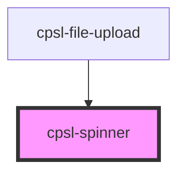

# cpsl-spinner

<!-- Auto Generated Below -->

## Properties

| Property | Attribute | Description                                             | Type     | Default |
| -------- | --------- | ------------------------------------------------------- | -------- | ------- |
| `size`   | `size`    | Size of the spinner in pixels. Default is 50.           | `number` | `54`    |
| `speed`  | `speed`   | Rotation speed of the spinner in seconds. Default is 1. | `number` | `1`     |

## Dependencies

### Used by

 - [cpsl-file-upload](../cpsl-file-upload)

### Graph

----------------------------------------------

*Built with [StencilJS](https://stenciljs.com/)*
