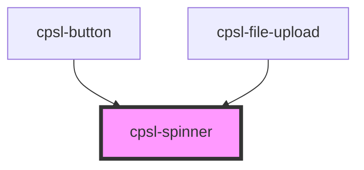

# cpsl-spinner

<!-- Auto Generated Below -->

## Properties

| Property   | Attribute   | Description                                             | Type                                          | Default     |
| ---------- | ----------- | ------------------------------------------------------- | --------------------------------------------- | ----------- |
| `barWidth` | `bar-width` | Width of the spinner arc in pixels. Default is 6.5.     | `number`                                      | `undefined` |
| `size`     | `size`      | Size of the spinner in pixels. Default is 50.           | `number`                                      | `54`        |
| `speed`    | `speed`     | Rotation speed of the spinner in seconds. Default is 1. | `number`                                      | `1`         |
| `variant`  | `variant`   | Variant of the spinner Default is 'pending'.            | `"error" \| "idle" \| "pending" \| "success"` | `'pending'` |

## Dependencies

### Used by

 - [cpsl-button](../cpsl-button)
 - [cpsl-file-upload](../cpsl-file-upload)

### Graph

----------------------------------------------

*Built with [StencilJS](https://stenciljs.com/)*
