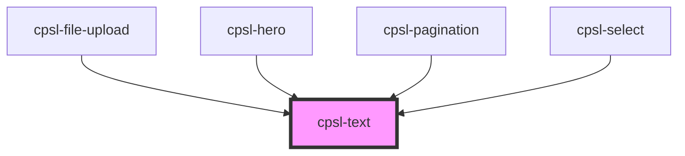

# cpsl-text

<!-- Auto Generated Below -->

## Properties

| Property  | Attribute | Description                                                                                                                                                                                                 | Type                                                                                                                                                         | Default     |
| --------- | --------- | ----------------------------------------------------------------------------------------------------------------------------------------------------------------------------------------------------------- | ------------------------------------------------------------------------------------------------------------------------------------------------------------ | ----------- |
| `align`   | `align`   | The text-align CSS property to apply. Options are: `"left"`, `"center", `"right". Default is: `"left"`.                                                                                                     | `"center" \| "left" \| "right"`                                                                                                                              | `undefined` |
| `color`   | `color`   | The color of text. Options are: `"primary"`, `"secondary", `"tertiary", `"subtle", `"inverted", `"error". Default is: `"primary"`.                                                                          | `"contrast" \| "error" \| "inverted" \| "primary" \| "secondary" \| "subtle" \| "success" \| "tertiary"`                                                     | `'primary'` |
| `variant` | `variant` | The variant of text. Options are: `"body2XS"`, `"bodyXS", `"bodyS", `"bodyM", `"bodyL", `"bodyXL", `"headingXS", `"headingS", `"headingM", `"headingL", `"headingXL", `"heading2XL". Default is: `"bodyM"`. | `"body2XS" \| "bodyL" \| "bodyM" \| "bodyS" \| "bodyXL" \| "bodyXS" \| "heading2XL" \| "headingL" \| "headingM" \| "headingS" \| "headingXL" \| "headingXS"` | `'bodyM'`   |
| `weight`  | `weight`  | The weight of text. Options are: `"regular"`, `"medium", `"semiBold", `"bold". Default is: `"regular"`.                                                                                                     | `"bold" \| "medium" \| "regular" \| "semiBold"`                                                                                                              | `'regular'` |

## Dependencies

### Used by

 - [cpsl-file-upload](../cpsl-file-upload)
 - [cpsl-hero](../cpsl-hero)
 - [cpsl-pagination](../cpsl-pagination)
 - [cpsl-select](../cpsl-select)

### Graph

----------------------------------------------

*Built with [StencilJS](https://stenciljs.com/)*
